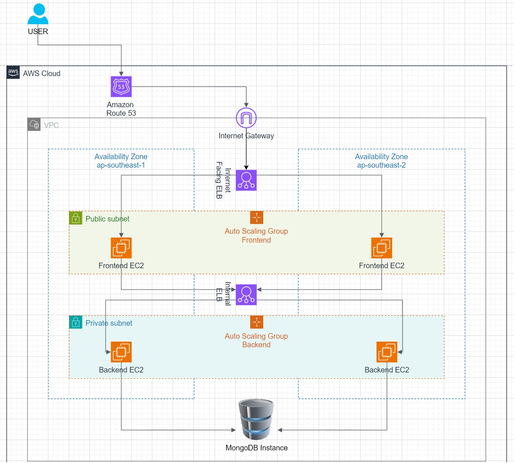
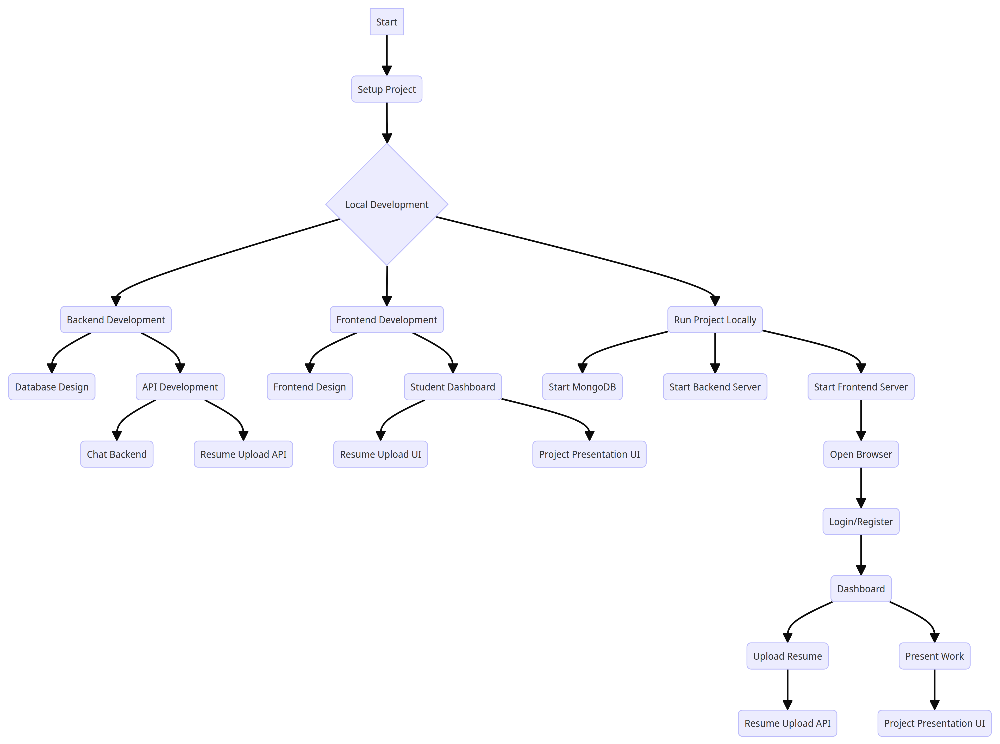

# MERN Stack Application Deployment using Jenkins, Kubernetes, GitHub Actions, and AWS

## Overview

This project involves the development, deployment, and management of a MERN (MongoDB, Express.js, React, Node.js) stack application using a robust CI/CD pipeline. The pipeline integrates Jenkins and GitHub Actions for continuous integration and delivery, while Kubernetes and AWS are leveraged for container orchestration and cloud infrastructure management.

## Objectives

### 1. Develop a Full-Stack MERN Application
- :file_folder: MongoDB: NoSQL database for data storage.
- :wrench: Express.js: Web application framework for Node.js.
- :react: React: Frontend library for building user interfaces.
- :node: Node.js: JavaScript runtime for backend development.

### 2. Implement CI/CD Pipeline
- :jenkins: Jenkins: Set up as a CI/CD server to automate builds, tests, and deployments.
- :github: GitHub Actions: Define workflows to facilitate CI/CD processes and integrate seamlessly with GitHub repositories.

### 3. Containerization and Orchestration
- :whale: Docker: Containerize the MERN application for consistent deployment.
- :kubernetes: Kubernetes: Orchestrate and manage containerized applications for scalability and reliability.

### 4. Cloud Infrastructure
- :aws: AWS (Amazon Web Services): Utilize AWS services for hosting the application, managing Kubernetes clusters (EKS), and ensuring scalability and high availability.

## Project Phases

1. *Application Development*
2. *Containerization*
3. *CI/CD Setup*
4. *Kubernetes Deployment*
5. *AWS Configuration*
6. *Monitoring and Logging*
7. *Continuous Improvement*

## Deliverables

1. :file_folder: *Source Code*: A well-documented GitHub repository with the complete MERN application.
2. :docker: *Docker Images*: Containerized versions of the application stored in Amazon ECR.
3. :jenkins: *CI/CD Pipelines*: Configured GitHub Actions and Jenkins pipelines.
4. :kubernetes: *Kubernetes Manifests*: YAML files for deploying the application on AWS EKS.
5. :page_facing_up: *Documentation*: Comprehensive documentation covering setup instructions, architecture diagrams, and usage guidelines.
6. :chart_with_upwards_trend: *Monitoring Dashboards*: Grafana dashboards for real-time monitoring of application performance.

## Conclusion

This project aims to provide a robust, scalable, and automated solution for deploying a MERN stack application using modern DevOps practices. Leveraging Jenkins, GitHub Actions, Kubernetes, and AWS ensures that the application is continuously integrated, delivered, and deployed with high efficiency and reliability.

# Student_career_platform
This application is for the student to create their resume and also act as a dashboard for presenting their work here.

## Architecture Diagram

## Workflow

## Deployment Files
1. [Frontend Deployment Files](deployment/frontend/)

2. [Backend Deployment Files](deployment/backend/)

